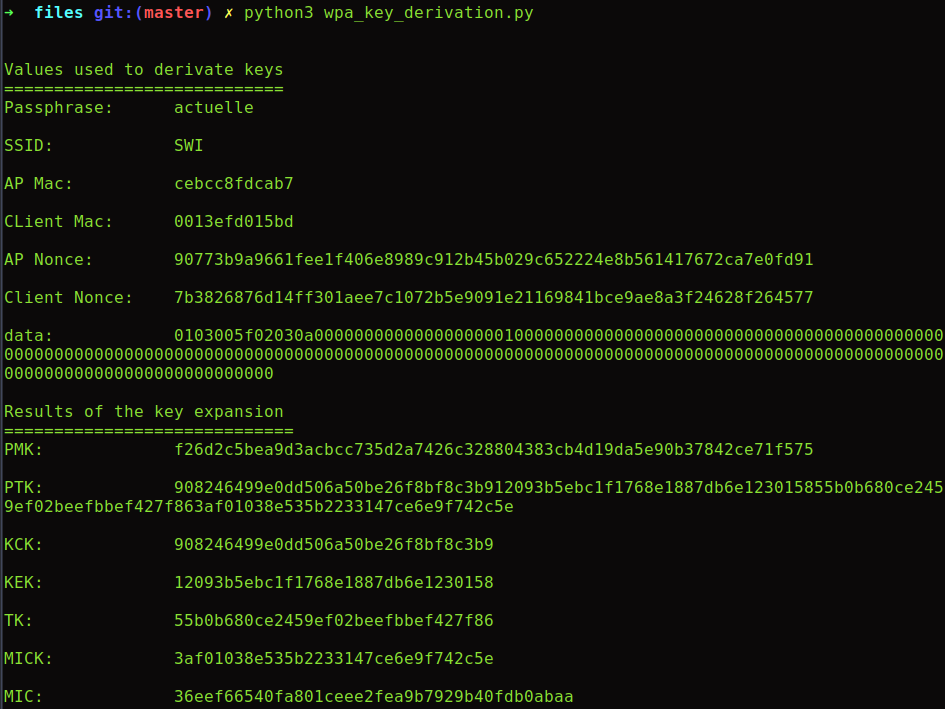
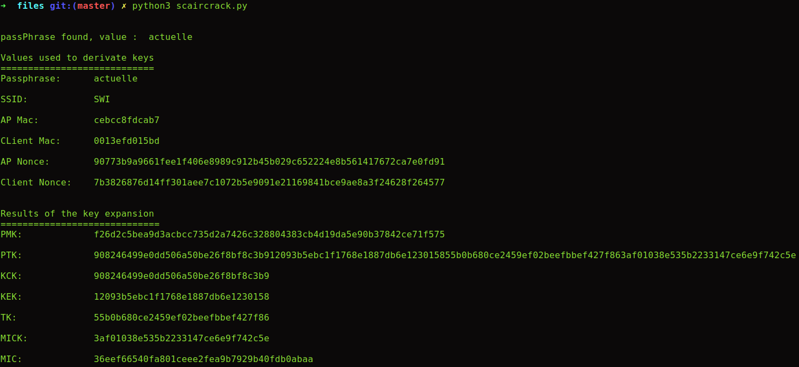

# Sécurité des réseaux sans fil
> Laboratoire: Labo4-WPA   
> Étudiants: Yimnaing Crescence, Siu Aurélien

### 1. Obtention des paramètres pour la dérivation des clés WPA

Pour faire fonctionner le script  wpa_key_derivation.py fourni, nous avons du trouver le fichier manquant `pbkdf2_math.py`. 

Voici la source du fichier:
https://github.com/Zeecka/PBKDF2-Python-hmaclib-custom-A/blob/master/pbkdf2_math.py

Nous avons ensuite du modifier celui-ci pour fonctionner avec Python 3, notamment au niveau des fonctions print. 

Ensuite, le module izip étant introuvable dans la librairie itertools utilisé pour la fonction zip a été supprimé. La fonction zip implémentée directement dans Python3 est utilisée en lieu et place. Voici la source qui nous a permis de comprendre:
https://stackoverflow.com/a/50483685

*Chemin du script :*

HEIGVD-SWI-Labo4-WPA/files/wpa_key_derivation.py

#### Utilisation du script :

    python3 wpa_key_derivation.py
    
#### Preuve de fonctionnement :

  

### 2. Scaircrack (aircrack basé sur Scapy)

*Chemin du script :*

HEIGVD-SWI-Labo4-WPA/files/scaircrack.py

#### Utilisation du script :

    python3 scaircrack.py

#### Preuve de fonctionnement :

